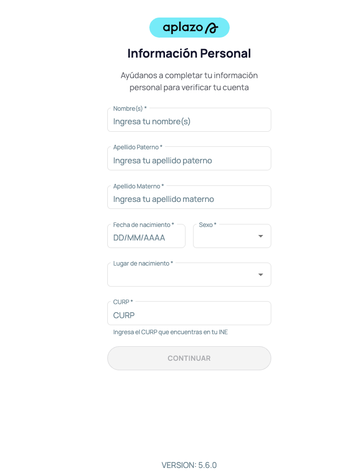

# Frontend

This frontend application consumes RESTful API endpoints from the backend.

## Key Features

- Fetches and displays customer information from the backend.
- Retrieves and displays loan information from the backend.

## Backend Dependency

Ensure the backend services are running before starting the frontend. The frontend relies on the following backend endpoints:

- Customer Creation: `[Backend URL]/customers`
- Customer Information Retrieval: `[Backend URL]/customers/{customerId}`
- Loan Creation: `[Backend URL]/loans`
- Loan Information Retrieval: `[Backend URL]/loans/{loanId}`

Replace `[Backend URL]` with the actual URL of your backend server.

## General Description

Inside the project, you will find a `projects` folder containing the component library we are building, named `shared-ui`. This library will be used by all projects in our team.

The application is located in the `src` folder, and the file organization is as follows (basic structure of an Angular application):

- **`config`**: This directory centralizes the application's configuration files, such as routes.
- **`entities`**: This directory centralizes the application's entities, such as data types and interfaces.
- **`guards`**: This directory centralizes the application's guards.
- **`pages`**: This directory centralizes the application's pages.
- **`services`**: This directory centralizes the application's services.

## Getting Started

To run the project, you need to have `Node.js` version 18+ and `npm` version 10+ installed on your computer.

```bash
# Install dependencies
npm install
```

```bash
# Build the component library
npm run build:ui
```

```bash
# Start the application in development mode
npm run dev:app
```

```bash
# Build the application for production
npm run build:app
```

## Tasks

### [Register](src/app/pages/register/register.component.ts)

The register feature is incomplete. The following is expected:

- [ ] Complete the layout kind of the image shown . Note that the fields "sexo", "lugar de nacimiento" and "curp" are not required in the scope of this project.
- [ ] The information should be sent to a backend endpoint to create a new user.
- [ ] Display error messages for invalid or missing fields (e.g., first name, last name, date of birth).
- [ ] Validate the date of birth to ensure the user is of legal age.
- [ ] After successful user creation, redirect to a "create loan" page.

### [App layout](src/app/features/layout/layout.component.ts)

- [ ] Generate a dynamic title depending on the route where the user is located 
- [ ] Add functionality to log out.

#### Nice to have

- [ ] When clicking on the logo, we should redirect the user to the `/apz/home` route.
- [ ] Add a guard to protect the `/apz/home` and `/apz/historial` routes from unauthenticated users.
- [ ] Add a guard to protect the `/auth` route from authenticated users.
- [ ] Dynamic icon in the [`sidenavLink`](projects/shared-ui/sidenav/src/sidenav-link/aplazo-sidenav-link.component.ts) (i.e., the icon is different for each link, and that icon can be injected from the parent component).
- [ ] Add unit tests to the components, services, guards, and other classes you consider necessary.

### [Home](src/app/features/home/infra/home.component.ts)

- [ ] Implement a form to create a loan. The form should include fields for:
  - [ ] Customer ID (should be a UUID).
  - [ ] Loan amount.
- [ ] The form should send the data to the `POST /loans` endpoint defined in the OpenAPI specification.
- [ ] Display appropriate error messages for invalid input or failed loan creation.
- [ ] After successful loan creation, display a success message and potentially redirect to the loan details page.

#### Nice to have

- [ ] Implement form validation to ensure the Customer ID is a valid UUID and the loan amount is within acceptable limits.
